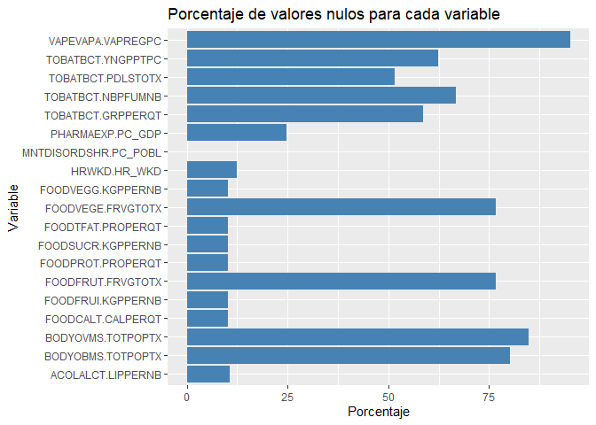

# Determinantes no biomédicos de salud

En este proyecto se estudiarán algunos de los determinants no biomédicos de salud en los países de la OCDE y su evolución en los últimos. Demostraremos como, a parte los habituales determinantes bioquímicos y genéticos, también existen muchos otros factores externos que pueden afectar a la salud de las personas.

> El siguiente código esta hecho en `R`, pero para la [visualización resultante](https://geovalexis.github.io/health-determinants/) se ha utilizado `javascript` junto con las librerías `D3` y `leaflet`. 


## Integración de datos

Nos basaremos principalmente en un dataset de la OCDE titulado "Non-medical determinants of health", el cual contiene multitud de características y nos servirá como punto de partida para combinarlos con otros parámetros interesantes, como por ejemplo el número de horas trabajadas o el gasto farmacéutico. Además, combinaremos estos datos con otro índice que está al orden del día: la salud mental.

```r
sources_dir = "./data/raw"
non_med_inds = read.csv(paste(sources_dir, "OECD-NON_MEDICAL_INDICATORS-2005_2019.csv", sep="/"),fileEncoding="UTF-8-BOM") #Los datasets de la OCDE vienen con el caracter BOM al principio del fichero, lo cual hace que aparezca `ï..` al principio del todo (https://stackoverflow.com/questions/24568056/rs-read-csv-prepending-1st-column-name-with-junk-text/24568505)
head(non_med_inds)
```

<div class="kable-table">

|VAR      |Variable         |UNIT     |Measure                  |COU |Country   |  YEA| Year| Value|Flag.Codes |Flags |
|:--------|:----------------|:--------|:------------------------|:---|:---------|----:|----:|-----:|:----------|:-----|
|FOODTFAT |Total fat supply |PROPERQT |Grams per capita per day |AUS |Australia | 2005| 2005| 137.3|           |      |
|FOODTFAT |Total fat supply |PROPERQT |Grams per capita per day |AUS |Australia | 2006| 2006| 143.4|           |      |
|FOODTFAT |Total fat supply |PROPERQT |Grams per capita per day |AUS |Australia | 2007| 2007| 143.9|           |      |
|FOODTFAT |Total fat supply |PROPERQT |Grams per capita per day |AUS |Australia | 2008| 2008| 141.0|           |      |
|FOODTFAT |Total fat supply |PROPERQT |Grams per capita per day |AUS |Australia | 2009| 2009| 143.6|           |      |
|FOODTFAT |Total fat supply |PROPERQT |Grams per capita per day |AUS |Australia | 2010| 2010| 145.9|           |      |

</div>

```r
summary(non_med_inds)
```

```
##      VAR              Variable             UNIT             Measure         
##  Length:11652       Length:11652       Length:11652       Length:11652      
##  Class :character   Class :character   Class :character   Class :character  
##  Mode  :character   Mode  :character   Mode  :character   Mode  :character  
##                                                                             
##                                                                             
##                                                                             
##      COU              Country               YEA            Year     
##  Length:11652       Length:11652       Min.   :2005   Min.   :2005  
##  Class :character   Class :character   1st Qu.:2009   1st Qu.:2009  
##  Mode  :character   Mode  :character   Median :2013   Median :2013  
##                                        Mean   :2012   Mean   :2012  
##                                        3rd Qu.:2016   3rd Qu.:2016  
##                                        Max.   :2020   Max.   :2020  
##      Value          Flag.Codes           Flags          
##  Min.   :   0.00   Length:11652       Length:11652      
##  1st Qu.:  16.20   Class :character   Class :character  
##  Median :  39.30   Mode  :character   Mode  :character  
##  Mean   : 252.13                                        
##  3rd Qu.:  84.22                                        
##  Max.   :3885.00
```

```r
pharma_spends = read.csv(paste(sources_dir, "OECD-PHARMACEUTICAL_SPENDING-1970_2020.csv", sep="/"),fileEncoding="UTF-8-BOM")
head(pharma_spends)
```

<div class="kable-table">

|LOCATION |INDICATOR |SUBJECT |MEASURE     |FREQUENCY | TIME|  Value|Flag.Codes |
|:--------|:---------|:-------|:-----------|:---------|----:|------:|:----------|
|AUS      |PHARMAEXP |TOT     |PC_HEALTHXP |A         | 1971| 15.992|           |
|AUS      |PHARMAEXP |TOT     |PC_HEALTHXP |A         | 1972| 15.091|           |
|AUS      |PHARMAEXP |TOT     |PC_HEALTHXP |A         | 1973| 15.117|           |
|AUS      |PHARMAEXP |TOT     |PC_HEALTHXP |A         | 1974| 14.771|           |
|AUS      |PHARMAEXP |TOT     |PC_HEALTHXP |A         | 1975| 11.849|           |
|AUS      |PHARMAEXP |TOT     |PC_HEALTHXP |A         | 1976| 10.920|           |

</div>

```r
summary(pharma_spends)
```

```
##    LOCATION          INDICATOR           SUBJECT            MEASURE         
##  Length:3814        Length:3814        Length:3814        Length:3814       
##  Class :character   Class :character   Class :character   Class :character  
##  Mode  :character   Mode  :character   Mode  :character   Mode  :character  
##                                                                             
##                                                                             
##                                                                             
##   FREQUENCY              TIME          Value           Flag.Codes       
##  Length:3814        Min.   :1970   Min.   :   0.207   Length:3814       
##  Class :character   1st Qu.:1989   1st Qu.:   1.482   Class :character  
##  Mode  :character   Median :2002   Median :  14.989   Mode  :character  
##                     Mean   :2000   Mean   : 112.076                     
##                     3rd Qu.:2012   3rd Qu.: 125.990                     
##                     Max.   :2020   Max.   :1376.270
```

```r
worked_hours = read.csv(paste(sources_dir, "OECD-HOURS_WORKED-1950_2020.csv", sep="/"),fileEncoding="UTF-8-BOM")
head(worked_hours)
```

<div class="kable-table">

|LOCATION |INDICATOR |SUBJECT |MEASURE |FREQUENCY | TIME| Value|Flag.Codes |
|:--------|:---------|:-------|:-------|:---------|----:|-----:|:----------|
|AUS      |HRWKD     |TOT     |HR_WKD  |A         | 1985|  1876|NA         |
|AUS      |HRWKD     |TOT     |HR_WKD  |A         | 1986|  1877|NA         |
|AUS      |HRWKD     |TOT     |HR_WKD  |A         | 1987|  1889|NA         |
|AUS      |HRWKD     |TOT     |HR_WKD  |A         | 1988|  1885|NA         |
|AUS      |HRWKD     |TOT     |HR_WKD  |A         | 1989|  1875|NA         |
|AUS      |HRWKD     |TOT     |HR_WKD  |A         | 1990|  1853|NA         |

</div>

```r
summary(worked_hours)
```

```
##    LOCATION          INDICATOR           SUBJECT            MEASURE         
##  Length:1752        Length:1752        Length:1752        Length:1752       
##  Class :character   Class :character   Class :character   Class :character  
##  Mode  :character   Mode  :character   Mode  :character   Mode  :character  
##                                                                             
##                                                                             
##                                                                             
##   FREQUENCY              TIME          Value      Flag.Codes    
##  Length:1752        Min.   :1950   Min.   :1332   Mode:logical  
##  Class :character   1st Qu.:1989   1st Qu.:1636   NA's:1752     
##  Mode  :character   Median :2001   Median :1776                 
##                     Mean   :1998   Mean   :1783                 
##                     3rd Qu.:2011   3rd Qu.:1918                 
##                     Max.   :2020   Max.   :2422
```

```r
mental_disords_share = read.csv(paste(sources_dir, "OWD-share_with_mental_health_or_development_disorder-1990_2016.csv", sep="/"))
head(mental_disords_share)
```

<div class="kable-table">

|Entity      |Code | Year| Prevalence...Mental.health.disorders..Both..age.standardized.percent.|
|:-----------|:----|----:|---------------------------------------------------------------------:|
|Afghanistan |AFG  | 1990|                                                              16.04647|
|Afghanistan |AFG  | 1991|                                                              16.09567|
|Afghanistan |AFG  | 1992|                                                              16.16511|
|Afghanistan |AFG  | 1993|                                                              16.21542|
|Afghanistan |AFG  | 1994|                                                              16.27130|
|Afghanistan |AFG  | 1995|                                                              16.33189|

</div>

```r
summary(mental_disords_share)
```

```
##     Entity              Code                Year     
##  Length:6156        Length:6156        Min.   :1990  
##  Class :character   Class :character   1st Qu.:1996  
##  Mode  :character   Mode  :character   Median :2003  
##                                        Mean   :2003  
##                                        3rd Qu.:2010  
##                                        Max.   :2016  
##  Prevalence...Mental.health.disorders..Both..age.standardized.percent.
##  Min.   :10.20                                                        
##  1st Qu.:12.09                                                        
##  Median :13.51                                                        
##  Mean   :13.50                                                        
##  3rd Qu.:14.60                                                        
##  Max.   :18.20
```

A partir del `summary` y de una visualización previa (en Excel) de los diferentes datasets, vemos que podemos realizar ya una pequeña limpieza preliminar de los datos.


```r
# La columna de "year" está repetida en dataset de "Non-medical determinants of health"
non_med_inds$YEA <- NULL
# Eliminamos la columna de "COUNTRY" del dataset principal ya que es redundante (la columna "COU" ya contiene los identificadores de los países en ISO 3166-1 alpha-3)
non_med_inds$Country <- NULL
# Las columnas de "Flag" y "Flag.Codes" son algunas anotaciones internas de la OCDE que no necesitaremos para este análisis
non_med_inds$Flags <- NULL
non_med_inds$Flag.Codes <- NULL
pharma_spends$Flag.Codes <- NULL
worked_hours$Flag.Codes <- NULL
```

De aquellos datasets que utilizaremos como indicadores extras ("Pharmaceutical Spending" y "Hours Worked") solo necesitaremos algunas de sus columnas. También adaptaremos su formato al dataset principal ("Non-medical determinants of health") para que posteriormente puedan ser añadidos directamente a ese dataset. 


```r
# Dataset de "Pharmaceutical Spending"
summary(pharma_spends)
```

```
##    LOCATION          INDICATOR           SUBJECT            MEASURE         
##  Length:3814        Length:3814        Length:3814        Length:3814       
##  Class :character   Class :character   Class :character   Class :character  
##  Mode  :character   Mode  :character   Mode  :character   Mode  :character  
##                                                                             
##                                                                             
##                                                                             
##   FREQUENCY              TIME          Value         
##  Length:3814        Min.   :1970   Min.   :   0.207  
##  Class :character   1st Qu.:1989   1st Qu.:   1.482  
##  Mode  :character   Median :2002   Median :  14.989  
##                     Mean   :2000   Mean   : 112.076  
##                     3rd Qu.:2012   3rd Qu.: 125.990  
##                     Max.   :2020   Max.   :1376.270
```

```r
## Renombrar columnas para que coincidan con el dataset principal
colnames(pharma_spends)[colnames(pharma_spends)=="LOCATION"] <- "COU"
colnames(pharma_spends)[colnames(pharma_spends)=="TIME"] <- "YEAR"
colnames(pharma_spends)[colnames(pharma_spends)=="INDICATOR"] <- "VAR"
colnames(pharma_spends)[colnames(pharma_spends)=="MEASURE"] <- "UNIT"
## Eliminar columnas redundantes o inncesarias para nuestro caso de uso
pharma_spends$SUBJECT <- NULL
pharma_spends$FREQUENCY <- NULL
## Añadir columna con breve descripción tanto de la variable/indicador como de la unidad/medida
pharma_spends$VARIABLE <- "Pharmaceutical spending"
map.measure_description.pharma <- new.env()
map.measure_description.pharma[["PC_HEALTHXP"]] <- "% of health spending"
map.measure_description.pharma[["PC_GDP"]] <- "% of GDP"
map.measure_description.pharma[["USD_CAP"]] <- "US dollars per capita"
pharma_spends$MEASURE <- with(pharma_spends, unlist(mget(UNIT, envir=map.measure_description.pharma)))

# Dataset "Hours Worked"
summary(worked_hours)
```

```
##    LOCATION          INDICATOR           SUBJECT            MEASURE         
##  Length:1752        Length:1752        Length:1752        Length:1752       
##  Class :character   Class :character   Class :character   Class :character  
##  Mode  :character   Mode  :character   Mode  :character   Mode  :character  
##                                                                             
##                                                                             
##                                                                             
##   FREQUENCY              TIME          Value     
##  Length:1752        Min.   :1950   Min.   :1332  
##  Class :character   1st Qu.:1989   1st Qu.:1636  
##  Mode  :character   Median :2001   Median :1776  
##                     Mean   :1998   Mean   :1783  
##                     3rd Qu.:2011   3rd Qu.:1918  
##                     Max.   :2020   Max.   :2422
```

```r
## Renombrar columnas para que coincidan con el dataset principal
colnames(worked_hours)[colnames(worked_hours)=="LOCATION"] <- "COU"
colnames(worked_hours)[colnames(worked_hours)=="TIME"] <- "YEAR"
colnames(worked_hours)[colnames(worked_hours)=="INDICATOR"] <- "VAR"
colnames(worked_hours)[colnames(worked_hours)=="MEASURE"] <- "UNIT"
## Eliminar columnas redundantes o inncesarias para nuestro caso de uso
worked_hours$SUBJECT <- NULL
worked_hours$FREQUENCY <- NULL
## Añadir columna con breve descripción tanto de la variable/indicador como de la unidad/medida
worked_hours$VARIABLE <- "Hours worked"
worked_hours$MEASURE <- "Hours/worker" # En este solo hay una unidad de medida
```

Una vez adaptado los indicadores extras, podemos añadirlos directamente al dataset principal, de modo que puedan ser tratados como otra fila más.


```r
# Primero nos aseguramos de que todos los nombres de las columnas sean iguales entre los diferentes datasets
colnames(non_med_inds) <- toupper(colnames(non_med_inds))
colnames(pharma_spends) <- toupper(colnames(pharma_spends))
colnames(worked_hours) <- toupper(colnames(worked_hours))
# Realizamos la unión de los datasets
mental_health_data = rbind(rbind(non_med_inds,pharma_spends), worked_hours)
summary(mental_health_data)
```

```
##      VAR              VARIABLE             UNIT             MEASURE         
##  Length:17218       Length:17218       Length:17218       Length:17218      
##  Class :character   Class :character   Class :character   Class :character  
##  Mode  :character   Mode  :character   Mode  :character   Mode  :character  
##                                                                             
##                                                                             
##                                                                             
##      COU                 YEAR          VALUE        
##  Length:17218       Min.   :1950   Min.   :   0.00  
##  Class :character   1st Qu.:2006   1st Qu.:  14.37  
##  Mode  :character   Median :2011   Median :  41.00  
##                     Mean   :2008   Mean   : 376.88  
##                     3rd Qu.:2015   3rd Qu.: 122.00  
##                     Max.   :2020   Max.   :3885.00
```

```r
# Comprobamos que tengamos todas los indicadores y los datos sean correctos
table(mental_health_data$VARIABLE)
```

```
## 
##                                    Alcohol consumption 
##                                                    655 
##                     Fruits consumption, daily (survey) 
##                                                    564 
##                                          Fruits supply 
##                                                    616 
##                                           Hours worked 
##                                                   1752 
##                             Obese population, measured 
##                                                    434 
##                        Obese population, self-reported 
##                                                    764 
##               Overweight or obese population, measured 
##                                                    328 
##          Overweight or obese population, self-reported 
##                                                    613 
##                        Overweight population, measured 
##                                                    347 
##                   Overweight population, self-reported 
##                                                    678 
##                                Pharmaceutical spending 
##                                                   3814 
##                                           Sugar supply 
##                                                    616 
##                                    Tobacco consumption 
##                                                   2537 
##                                  Total calories supply 
##                                                    616 
##                                       Total fat supply 
##                                                    616 
##                                   Total protein supply 
##                                                    616 
##                   Vaping population: adults (aged 15+) 
##                                                    263 
## Vaping population: young adults (aged 15-24 years old) 
##                                                    212 
##                 Vegetables consumption, daily (survey) 
##                                                    561 
##                                      Vegetables supply 
##                                                    616
```

```r
table(mental_health_data$YEAR)
```

```
## 
## 1950 1951 1952 1953 1954 1955 1956 1957 1958 1959 1960 1961 1962 1963 1964 1965 
##    3    3    3    3    3    3    3    3    3    3    4    5    6    6    6    6 
## 1966 1967 1968 1969 1970 1971 1972 1973 1974 1975 1976 1977 1978 1979 1980 1981 
##    6    6    6    6   52   52   52   52   52   58   59   60   60   60   76   74 
## 1982 1983 1984 1985 1986 1987 1988 1989 1990 1991 1992 1993 1994 1995 1996 1997 
##   74   75   78   82   81   85   86   86   98   95   97   99  104  117  117  114 
## 1998 1999 2000 2001 2002 2003 2004 2005 2006 2007 2008 2009 2010 2011 2012 2013 
##  105  114  119  119  125  137  146  787  842  837  921  907  878  791  928  848 
## 2014 2015 2016 2017 2018 2019 2020 
## 1273  928  993 1078  933  910  217
```

```r
table(mental_health_data$COU)
```

```
## 
##  AUS  AUT  BEL  BGR  BRA  CAN  CHE  CHL  CHN  COL  CRI  CYP  CZE  DEU  DNK  ESP 
##  415  287  375   68  300  685  246  229  144  149  209   77  421  401  399  401 
##  EST EU27  FIN  FRA  GBR  GRC  HRV  HUN  IDN  IND  IRL  ISL  ISR  ITA  JPN  KOR 
##  368   26  722  460  555  375   53  339  145  147  439  535  341  587  464  675 
##  LTU  LUX  LVA  MEX  MLT  NLD  NOR  NZL OECD  POL  PRT  ROU  RUS  SVK  SVN  SWE 
##  239  380  319  280   41  602  551  507   51  249  358   77  212  277  245  641 
##  TUR  USA  ZAF 
##  350  658  144
```

Debemos que tener en cuenta que el dataset resultante tendrá nuevos valores en la columna de "YEAR" (los diferentes datasets tienen rango temporales distintos) y por tanto el *time span* de nuestros datos se verá afectado.

Solo nos falta combinar los datos del dataset de "índice de enfermedad mental". En este caso, al no ser un dataset extraido de la misma fuente (es de *Our World in Data*), no disponemos de las misma estructura, por lo que, al igual que los los anteriores indicadores, tendremos que adaptar las estructura al dataset principal para despues poder fusionarlo. Por suerte, el dataset dispone de una columna con el codigo del pais (en `ISO3`) y otra con el año correspondiente al valor. Dado que este dataset contiene datos globales, contendrá información relativa a países que no están en la OCDE (nuestro dataset principal), por tanto, filtraremos por solo aquellos países miembros de la OCDE. 


```r
summary(mental_disords_share)
```

```
##     Entity              Code                Year     
##  Length:6156        Length:6156        Min.   :1990  
##  Class :character   Class :character   1st Qu.:1996  
##  Mode  :character   Mode  :character   Median :2003  
##                                        Mean   :2003  
##                                        3rd Qu.:2010  
##                                        Max.   :2016  
##  Prevalence...Mental.health.disorders..Both..age.standardized.percent.
##  Min.   :10.20                                                        
##  1st Qu.:12.09                                                        
##  Median :13.51                                                        
##  Mean   :13.50                                                        
##  3rd Qu.:14.60                                                        
##  Max.   :18.20
```

```r
# Renombrar columnas con nombres más precisos y eliminar redundancias
colnames(mental_disords_share) <- c("COUNTRY","COU","YEAR","VALUE")
mental_disords_share$COUNTRY <- NULL # Redundante
# Eliminar aquellos países que no sean miembros oficiales de la OCDE
ocde_members <- levels(factor(mental_health_data$COU))
mental_disords_share <- mental_disords_share[mental_disords_share$COU %in% ocde_members,]
setdiff(ocde_members, levels(factor(mental_disords_share$COU)))
```

```
## [1] "EU27" "OECD"
```

```r
# Crear nuevas columnas necesarias para unirlo con el dataset principal
mental_disords_share$VAR <- "MNTDISORDSHR"
mental_disords_share$VARIABLE <- "Mental disorder share"
mental_disords_share$UNIT <- "PC_POBL"
mental_disords_share$MEASURE <- "% of poblation"
summary(mental_disords_share)
```

```
##      COU                 YEAR          VALUE           VAR           
##  Length:1323        Min.   :1990   Min.   :10.20   Length:1323       
##  Class :character   1st Qu.:1996   1st Qu.:12.08   Class :character  
##  Mode  :character   Median :2003   Median :14.50   Mode  :character  
##                     Mean   :2003   Mean   :13.92                     
##                     3rd Qu.:2010   3rd Qu.:15.30                     
##                     Max.   :2016   Max.   :18.20                     
##    VARIABLE             UNIT             MEASURE         
##  Length:1323        Length:1323        Length:1323       
##  Class :character   Class :character   Class :character  
##  Mode  :character   Mode  :character   Mode  :character  
##                                                          
##                                                          
## 
```

```r
head(mental_disords_share)
```

<div class="kable-table">

|    |COU | YEAR|    VALUE|VAR          |VARIABLE              |UNIT    |MEASURE        |
|:---|:---|----:|--------:|:------------|:---------------------|:-------|:--------------|
|298 |AUS | 1990| 17.58423|MNTDISORDSHR |Mental disorder share |PC_POBL |% of poblation |
|299 |AUS | 1991| 17.60027|MNTDISORDSHR |Mental disorder share |PC_POBL |% of poblation |
|300 |AUS | 1992| 17.62647|MNTDISORDSHR |Mental disorder share |PC_POBL |% of poblation |
|301 |AUS | 1993| 17.65558|MNTDISORDSHR |Mental disorder share |PC_POBL |% of poblation |
|302 |AUS | 1994| 17.68672|MNTDISORDSHR |Mental disorder share |PC_POBL |% of poblation |
|303 |AUS | 1995| 17.69729|MNTDISORDSHR |Mental disorder share |PC_POBL |% of poblation |

</div>

```r
# Ahora si podemos añadir estos datos al dataset principal
mental_health_data <- rbind(mental_health_data, mental_disords_share)
head(mental_health_data)
```

<div class="kable-table">

|VAR      |VARIABLE         |UNIT     |MEASURE                  |COU | YEAR| VALUE|
|:--------|:----------------|:--------|:------------------------|:---|----:|-----:|
|FOODTFAT |Total fat supply |PROPERQT |Grams per capita per day |AUS | 2005| 137.3|
|FOODTFAT |Total fat supply |PROPERQT |Grams per capita per day |AUS | 2006| 143.4|
|FOODTFAT |Total fat supply |PROPERQT |Grams per capita per day |AUS | 2007| 143.9|
|FOODTFAT |Total fat supply |PROPERQT |Grams per capita per day |AUS | 2008| 141.0|
|FOODTFAT |Total fat supply |PROPERQT |Grams per capita per day |AUS | 2009| 143.6|
|FOODTFAT |Total fat supply |PROPERQT |Grams per capita per day |AUS | 2010| 145.9|

</div>

```r
summary(mental_health_data)
```

```
##      VAR              VARIABLE             UNIT             MEASURE         
##  Length:18541       Length:18541       Length:18541       Length:18541      
##  Class :character   Class :character   Class :character   Class :character  
##  Mode  :character   Mode  :character   Mode  :character   Mode  :character  
##                                                                             
##                                                                             
##                                                                             
##      COU                 YEAR          VALUE        
##  Length:18541       Min.   :1950   Min.   :   0.00  
##  Class :character   1st Qu.:2005   1st Qu.:  13.69  
##  Mode  :character   Median :2010   Median :  34.60  
##                     Mean   :2008   Mean   : 350.99  
##                     3rd Qu.:2015   3rd Qu.: 109.90  
##                     Max.   :2020   Max.   :3885.00
```

Comprobando si se había filtrado correctamente por países de la OCDE, nos hemos dado cuenta de que existen dos códigos ("EU27" y "OECD") en el dataset principal que realmente no corresponden a ningún país, sino que son agregaciones de éstos. Dejaremos la decisión de si prescindir de estos datos o no para más adelante. 


## Preprocesado

Una vez integrado los datos, vamos a proceder con el preprocesado de datos. Lo primero que vamos a hacer será reestructurar el dataset de manera que nos sea más fácil trabajar con ellos. Para ello agruparemos los datos de forma que todas las variables (columna de `VAR`) queden identificadas por su año, país y variable, es decir, pivotaremos estas filas para que queden como columnas.

Antes de nada, eliminaremos las columnas que contienen la descripción de cada variable (VARIABLE) y cada medida (MEASURE), ya que nos supondrá una carga extra a la hora de hacer las "pivotaciones". Nos guardaremos las equivalencia como referencia a donde consultar mas adelante.


```r
all_vars.by_metrics <- unique(mental_health_data[c("VAR","VARIABLE", "UNIT","MEASURE")])
mental_health_data <- mental_health_data[c("COU", "YEAR","VAR", "UNIT", "VALUE")]
summary(mental_health_data)
```

```
##      COU                 YEAR          VAR                UNIT          
##  Length:18541       Min.   :1950   Length:18541       Length:18541      
##  Class :character   1st Qu.:2005   Class :character   Class :character  
##  Mode  :character   Median :2010   Mode  :character   Mode  :character  
##                     Mean   :2008                                        
##                     3rd Qu.:2015                                        
##                     Max.   :2020                                        
##      VALUE        
##  Min.   :   0.00  
##  1st Qu.:  13.69  
##  Median :  34.60  
##  Mean   : 350.99  
##  3rd Qu.: 109.90  
##  Max.   :3885.00
```

```r
head(mental_health_data)
```

<div class="kable-table">

|COU | YEAR|VAR      |UNIT     | VALUE|
|:---|----:|:--------|:--------|-----:|
|AUS | 2005|FOODTFAT |PROPERQT | 137.3|
|AUS | 2006|FOODTFAT |PROPERQT | 143.4|
|AUS | 2007|FOODTFAT |PROPERQT | 143.9|
|AUS | 2008|FOODTFAT |PROPERQT | 141.0|
|AUS | 2009|FOODTFAT |PROPERQT | 143.6|
|AUS | 2010|FOODTFAT |PROPERQT | 145.9|

</div>


```r
if (!require('tidyr')) install.packages('tidyr')
library(tidyr)
# Lo que hace la siguiente función es agrupar los valores de ciertas columnas ("values_from") 
# en función de las columnas indicadas ("names_from")
mental_health_data <- mental_health_data %>%
  pivot_wider(names_from=c(VAR,UNIT), values_from = VALUE, names_sep = ".")
head(mental_health_data)
```

<div class="kable-table">

|COU | YEAR| FOODTFAT.PROPERQT| FOODCALT.CALPERQT| FOODPROT.PROPERQT| FOODSUCR.KGPPERNB| FOODFRUI.KGPPERNB| FOODVEGE.FRVGFMTF| FOODVEGE.FRVGHOTH| FOODVEGE.FRVGTOTX| FOODFRUT.FRVGFMTF| FOODFRUT.FRVGHOTH| FOODFRUT.FRVGTOTX| ACOLALCT.LIPPERNB| TOBATBCT.GRPPERQT| TOBATBCT.NBPFUMNB| TOBATBCT.PDLSFMTF| TOBATBCT.PDLSHOTH| TOBATBCT.PDLSTOTX| TOBATBCT.YNGPPTPC| TOBATBCT.YNGPPHPH| TOBATBCT.YNGPPFPF| BODYOVSR.PERWOMTF| BODYOVSR.PERMANTH| BODYOVSR.TOTPOPTX| BODYOBSR.PERWOMTF| BODYOBSR.PERMANTH| BODYOBSR.TOTPOPTX| BODYVBSR.PERWOMTF| BODYVBSR.PERMANTH| BODYVBSR.TOTPOPTX| BODYOVMS.PERWOMTF| BODYOVMS.PERMANTH| BODYOVMS.TOTPOPTX| BODYOBMS.PERWOMTF| BODYOBMS.PERMANTH| BODYOBMS.TOTPOPTX| BODYVBMS.PERWOMTF| BODYVBMS.PERMANTH| BODYVBMS.TOTPOPTX| FOODVEGG.KGPPERNB| VAPEVAPY.VAPREGPF| VAPEVAPY.VAPREGPC| VAPEVAPY.VAPREGPH| VAPEVAPA.VAPREGPF| VAPEVAPA.VAPREGPC| VAPEVAPA.VAPREGPH| PHARMAEXP.PC_HEALTHXP| PHARMAEXP.PC_GDP| PHARMAEXP.USD_CAP| HRWKD.HR_WKD| MNTDISORDSHR.PC_POBL|
|:---|----:|-----------------:|-----------------:|-----------------:|-----------------:|-----------------:|-----------------:|-----------------:|-----------------:|-----------------:|-----------------:|-----------------:|-----------------:|-----------------:|-----------------:|-----------------:|-----------------:|-----------------:|-----------------:|-----------------:|-----------------:|-----------------:|-----------------:|-----------------:|-----------------:|-----------------:|-----------------:|-----------------:|-----------------:|-----------------:|-----------------:|-----------------:|-----------------:|-----------------:|-----------------:|-----------------:|-----------------:|-----------------:|-----------------:|-----------------:|-----------------:|-----------------:|-----------------:|-----------------:|-----------------:|-----------------:|---------------------:|----------------:|-----------------:|------------:|--------------------:|
|AUS | 2005|             137.3|              3099|             104.9|              46.8|             108.1|                NA|                NA|                NA|                NA|                NA|                NA|              10.5|              1219|                NA|                NA|                NA|                NA|                NA|                NA|                NA|                NA|                NA|                NA|                NA|                NA|                NA|                NA|                NA|                NA|                NA|                NA|                NA|                NA|                NA|                NA|                NA|                NA|                NA|              97.8|                NA|                NA|                NA|                NA|                NA|                NA|                15.218|            1.216|           437.125|         1808|             18.19619|
|AUS | 2006|             143.4|              3156|             104.6|              46.4|             100.7|                NA|                NA|                NA|                NA|                NA|                NA|              10.8|              1180|                NA|                NA|                NA|                NA|                NA|                NA|                NA|                NA|                NA|                NA|                NA|                NA|                NA|                NA|                NA|                NA|                NA|                NA|                NA|                NA|                NA|                NA|                NA|                NA|                NA|              97.5|                NA|                NA|                NA|                NA|                NA|                NA|                15.276|            1.220|           457.494|         1802|             18.17164|
|AUS | 2007|             143.9|              3198|             108.3|              47.4|             105.2|                99|                99|                99|                95|                92|                94|              10.8|              1201|              13.9|              15.4|              18.3|              16.9|              13.4|              13.9|              12.9|                28|                41|              34.6|              20.3|              22.3|              21.3|              48.3|              63.3|                56|                31|              42.2|              36.7|              23.6|              25.5|              24.6|              54.7|              67.7|              61.2|              99.7|                NA|                NA|                NA|                NA|                NA|                NA|                15.201|            1.226|           486.056|         1803|             18.14014|
|AUS | 2008|             141.0|              3199|             106.5|              47.0|             101.6|                NA|                NA|                NA|                NA|                NA|                NA|              10.8|              1130|                NA|                NA|                NA|                NA|                NA|                NA|                NA|                NA|                NA|                NA|                NA|                NA|                NA|                NA|                NA|                NA|                NA|                NA|                NA|                NA|                NA|                NA|                NA|                NA|                NA|             102.3|                NA|                NA|                NA|                NA|                NA|                NA|                15.412|            1.272|           516.333|         1799|             18.11225|
|AUS | 2009|             143.6|              3205|             103.3|              45.9|              98.7|                NA|                NA|                NA|                NA|                NA|                NA|              10.7|              1064|                NA|                NA|                NA|                NA|                NA|                NA|                NA|                NA|                NA|                NA|                NA|                NA|                NA|                NA|                NA|                NA|                NA|                NA|                NA|                NA|                NA|                NA|                NA|                NA|                NA|              97.0|                NA|                NA|                NA|                NA|                NA|                NA|                15.535|            1.330|           531.598|         1767|             18.07001|
|AUS | 2010|             145.9|              3213|             103.8|              46.1|             100.0|                NA|                NA|                NA|                NA|                NA|                NA|              10.4|              1009|              15.9|              14.1|              16.6|              15.3|              12.6|              13.2|              11.8|                NA|                NA|                NA|                NA|                NA|                NA|                NA|                NA|                NA|                NA|                NA|                NA|                NA|                NA|                NA|                NA|                NA|                NA|              97.8|                NA|                NA|                NA|                NA|                NA|                NA|                15.630|            1.318|           561.931|         1778|             18.04403|

</div>

```r
# Guardamos este dataset
#write.csv(mental_health_data, file = paste(sources_dir,"CUSTOM-MENTAL_HEALTH_DATA-1950_2020-spread.csv",sep="/"))
```

### Selección de variables

Anteriormente hemos visto como había dos códigos que no correspondían a ningún pais: "EU27" y "OECD". Asimismo, nos hemos dado cuenta de que el rango de años en el que nos movemos varía en función del dataset. Es por ello que a continuación realizaremos un selección preliminar de variables y observaciones.

Los códigos "EU27" y "OECD" son bastante descriptivos: son agregaciones de los valores que los países de la Unión Europea y de todos los países pertenecientes a la OECD, respectivamente. Dado que nuestro enfoque va a ser utilizar cada una de las variables de los distintos países de la OCDE y que ya disponemos de los datos individuales de cada país (y por tanto podríamos obtener estas agregaciones "manualmente"), no veo necesario mantener estos dos registros. Además, aprovecharemos a convertir esta columna a `factor`. 


```r
mental_health_data <- mental_health_data[!mental_health_data$COU %in% c("EU27","OECD"),]
mental_health_data$COU <- as.factor(mental_health_data$COU)
table(mental_health_data$COU)
```

```
## 
## AUS AUT BEL BGR BRA CAN CHE CHL CHN COL CRI CYP CZE DEU DNK ESP EST FIN FRA GBR 
##  50  31  51  31  30  60  31  35  30  30  34  31  31  51  51  44  31  61  71  51 
## GRC HRV HUN IDN IND IRL ISL ISR ITA JPN KOR LTU LUX LVA MEX MLT NLD NOR NZL POL 
##  51  31  41  30  30  51  51  40  33  51  51  31  51  31  31  31  51  59  43  31 
## PRT ROU RUS SVK SVN SWE TUR USA ZAF 
##  51  31  31  31  31  71  50  71  30
```

Vemos como tenemos la misma cantidad de registro por país, lo cual sería lo ideal. Esto es por lo mismo que se ha mencionado anteriormente, al provenir los datos de datasets con distintas fechas, no disponemos de la misma cantidad de observaciones por país. Esto lo podemos solucionar escogiendo un rango de fechas óptimo, que sería aquel en donde mayor cantidad de observaciones podamos tener y menor nº de nulos. Para ello podemos estudiar en los rangos de fechas en los que se movían nuestras distintas fuentes y elegir el rango en el que todas coincidan.


```r
summary(non_med_inds$YEAR)
```

```
##    Min. 1st Qu.  Median    Mean 3rd Qu.    Max. 
##    2005    2009    2013    2012    2016    2020
```

```r
summary(pharma_spends$YEAR)
```

```
##    Min. 1st Qu.  Median    Mean 3rd Qu.    Max. 
##    1970    1989    2002    2000    2012    2020
```

```r
summary(worked_hours$YEAR)
```

```
##    Min. 1st Qu.  Median    Mean 3rd Qu.    Max. 
##    1950    1989    2001    1998    2011    2020
```

```r
summary(mental_disords_share$YEAR)
```

```
##    Min. 1st Qu.  Median    Mean 3rd Qu.    Max. 
##    1990    1996    2003    2003    2010    2016
```

Si nos fijamos en el mínimo y máximo de cada uno, nos damos cuenta de que el rango común para todos es el de 2005 a 2016. Esto nos reduciría bastante nuestro *time span* final pero es algo que debemos de hacer si queremos minimizar la cantidad de nulos. En caso que el modelo de predicción que implementemos en posteriormente (en la PRA2) no sea capaz de aprender de nuestros datos porque hay insuficientes observaciones, tendríamos que replantearnos la posibilidad de prescindir de algunos de nuestros datasets (de modo que no nos limite su rango de fecha) o bien sustituirlos por otros con rangos de fechas mas amplios. 


```r
mental_health_data <- mental_health_data[mental_health_data$YEAR>=2005 & mental_health_data$YEAR <= 2016,]
```

Por último, es importante destacar que en el dataset existen diversas algunas variables que son expresadas en medidas diferentes (sobretodo en dataset base, el de "Non-Medical Indicators of Health"). Convendría seleccionar y modelar las métricas en base a nuestro objetivo.  


```r
all_vars.by_metrics[,c("VAR", "VARIABLE")]
```

<div class="kable-table">

|      |VAR          |VARIABLE                                               |
|:-----|:------------|:------------------------------------------------------|
|1     |FOODTFAT     |Total fat supply                                       |
|561   |FOODCALT     |Total calories supply                                  |
|1121  |FOODPROT     |Total protein supply                                   |
|1681  |FOODSUCR     |Sugar supply                                           |
|2241  |FOODFRUI     |Fruits supply                                          |
|2801  |FOODVEGE     |Vegetables consumption, daily (survey)                 |
|2805  |FOODVEGE     |Vegetables consumption, daily (survey)                 |
|2809  |FOODVEGE     |Vegetables consumption, daily (survey)                 |
|3332  |FOODFRUT     |Fruits consumption, daily (survey)                     |
|3336  |FOODFRUT     |Fruits consumption, daily (survey)                     |
|3340  |FOODFRUT     |Fruits consumption, daily (survey)                     |
|3866  |ACOLALCT     |Alcohol consumption                                    |
|4461  |TOBATBCT     |Tobacco consumption                                    |
|4474  |TOBATBCT     |Tobacco consumption                                    |
|4479  |TOBATBCT     |Tobacco consumption                                    |
|4484  |TOBATBCT     |Tobacco consumption                                    |
|4489  |TOBATBCT     |Tobacco consumption                                    |
|4494  |TOBATBCT     |Tobacco consumption                                    |
|4499  |TOBATBCT     |Tobacco consumption                                    |
|4504  |TOBATBCT     |Tobacco consumption                                    |
|6910  |BODYOVSR     |Overweight population, self-reported                   |
|6912  |BODYOVSR     |Overweight population, self-reported                   |
|6914  |BODYOVSR     |Overweight population, self-reported                   |
|7558  |BODYOBSR     |Obese population, self-reported                        |
|7560  |BODYOBSR     |Obese population, self-reported                        |
|7562  |BODYOBSR     |Obese population, self-reported                        |
|8291  |BODYVBSR     |Overweight or obese population, self-reported          |
|8293  |BODYVBSR     |Overweight or obese population, self-reported          |
|8295  |BODYVBSR     |Overweight or obese population, self-reported          |
|8880  |BODYOVMS     |Overweight population, measured                        |
|8884  |BODYOVMS     |Overweight population, measured                        |
|8888  |BODYOVMS     |Overweight population, measured                        |
|9206  |BODYOBMS     |Obese population, measured                             |
|9210  |BODYOBMS     |Obese population, measured                             |
|9214  |BODYOBMS     |Obese population, measured                             |
|9619  |BODYVBMS     |Overweight or obese population, measured               |
|9623  |BODYVBMS     |Overweight or obese population, measured               |
|9627  |BODYVBMS     |Overweight or obese population, measured               |
|9938  |FOODVEGG     |Vegetables supply                                      |
|11163 |VAPEVAPY     |Vaping population: young adults (aged 15-24 years old) |
|11164 |VAPEVAPY     |Vaping population: young adults (aged 15-24 years old) |
|11166 |VAPEVAPY     |Vaping population: young adults (aged 15-24 years old) |
|11168 |VAPEVAPA     |Vaping population: adults (aged 15+)                   |
|11185 |VAPEVAPA     |Vaping population: adults (aged 15+)                   |
|11200 |VAPEVAPA     |Vaping population: adults (aged 15+)                   |
|11653 |PHARMAEXP    |Pharmaceutical spending                                |
|12797 |PHARMAEXP    |Pharmaceutical spending                                |
|12845 |PHARMAEXP    |Pharmaceutical spending                                |
|15467 |HRWKD        |Hours worked                                           |
|29810 |MNTDISORDSHR |Mental disorder share                                  |

</div>

```r
all_vars.by_metrics[,c("UNIT", "MEASURE")]
```

<div class="kable-table">

|      |UNIT        |MEASURE                                                    |
|:-----|:-----------|:----------------------------------------------------------|
|1     |PROPERQT    |Grams per capita per day                                   |
|561   |CALPERQT    |Kilocalories per capita per day                            |
|1121  |PROPERQT    |Grams per capita per day                                   |
|1681  |KGPPERNB    |Kilos per capita per year                                  |
|2241  |KGPPERNB    |Kilos per capita per year                                  |
|2801  |FRVGFMTF    |% of females aged 15 years old and over                    |
|2805  |FRVGHOTH    |% of males aged 15 years old and over                      |
|2809  |FRVGTOTX    |% of population aged 15 years old and over                 |
|3332  |FRVGFMTF    |% of females aged 15 years old and over                    |
|3336  |FRVGHOTH    |% of males aged 15 years old and over                      |
|3340  |FRVGTOTX    |% of population aged 15 years old and over                 |
|3866  |LIPPERNB    |Litres per capita (15+)                                    |
|4461  |GRPPERQT    |Grams per capita (15+)                                     |
|4474  |NBPFUMNB    |Cigarettes per smoker per day                              |
|4479  |PDLSFMTF    |% of females aged 15+ who are daily smokers                |
|4484  |PDLSHOTH    |% of males aged 15+ who are daily smokers                  |
|4489  |PDLSTOTX    |% of population aged 15+ who are daily smokers             |
|4494  |YNGPPTPC    |% of population aged 15-24 years old who are daily smokers |
|4499  |YNGPPHPH    |% of males aged 15-24 years old who are daily smokers      |
|4504  |YNGPPFPF    |% of females aged 15-24 years old who are daily smokers    |
|6910  |PERWOMTF    |% of females                                               |
|6912  |PERMANTH    |% of males                                                 |
|6914  |TOTPOPTX    |% of total population                                      |
|7558  |PERWOMTF    |% of females                                               |
|7560  |PERMANTH    |% of males                                                 |
|7562  |TOTPOPTX    |% of total population                                      |
|8291  |PERWOMTF    |% of females                                               |
|8293  |PERMANTH    |% of males                                                 |
|8295  |TOTPOPTX    |% of total population                                      |
|8880  |PERWOMTF    |% of females                                               |
|8884  |PERMANTH    |% of males                                                 |
|8888  |TOTPOPTX    |% of total population                                      |
|9206  |PERWOMTF    |% of females                                               |
|9210  |PERMANTH    |% of males                                                 |
|9214  |TOTPOPTX    |% of total population                                      |
|9619  |PERWOMTF    |% of females                                               |
|9623  |PERMANTH    |% of males                                                 |
|9627  |TOTPOPTX    |% of total population                                      |
|9938  |KGPPERNB    |Kilos per capita per year                                  |
|11163 |VAPREGPF    |% of females who are regular users                         |
|11164 |VAPREGPC    |% of population who are regular users                      |
|11166 |VAPREGPH    |% of males who are regular users                           |
|11168 |VAPREGPF    |% of females who are regular users                         |
|11185 |VAPREGPC    |% of population who are regular users                      |
|11200 |VAPREGPH    |% of males who are regular users                           |
|11653 |PC_HEALTHXP |% of health spending                                       |
|12797 |PC_GDP      |% of GDP                                                   |
|12845 |USD_CAP     |US dollars per capita                                      |
|15467 |HR_WKD      |Hours/worker                                               |
|29810 |PC_POBL     |% of poblation                                             |

</div>

Observamos como existen diversas métricas de medida para una misma variable. Muchas de estas métricas se deben a que se separa por **grupos de población** (Hombres vs Mujeres, población de entre 15-24 vs población mayor de 15). En nuestro caso, no nos interesa realizar esta distinción ya que los otros indicadores de los disponemos (incluida la variable objetivo) hacen referencia a la población general, por tanto, debemos ceñirnos a este criterio. 

Por otro lado, también existen variables que hacen referencia a la misma entidad pero con diferente tipo de medición, como es el caso de población obesa (*Obese population*) y sobrepeso (*overweight* ), para las cuales existen dos tipos de mediciones: **reportado voluntariamente** (*self-reported*) o **medido** (*measured*). Para ser lo más precisos posibles mantendremos solo las métricas que hagan referencia a mediciones "reales", por tanto, mantendremos aquellas que dicen *measured*. Para estas mismas dos variables, existe una variable adicional llamada *Overweight or obese population*, que combina las dos mediante la lógica "OR". Creo que nos conviene más tenerlas separadas y que sea nuestro modelo que se encargue de relacionarlas (si es que existe una relación).

Por último, en el dataset de "Pharmarceutical spending", vemos que tenemos 3 tipos de medidas a elegir: *% of health spending* (PC_HEALTHXP), *% of GDP* (PC_GDP) y *US dollars per capita* (USD_CAP). Dado que en nuestro análisis no solo vamos a tener en cuenta datos de USA, sino de **todos los países de al OCDE** (la mayoría europeos), descartamos utilizar USD_CAP como medida. Entre PC_HEALTHXP y PC_GDP, nos vamos a decantar por PC_GDP, ya parece una métrica más descriptiva y directa de interpretar. 


```r
# Eliminamos las variables de "Overweight or obese population"
mental_health_data <- mental_health_data[-grep("BODYVB", colnames(mental_health_data))]

# Eliminamos las variables con metricas de "self-reported"
mental_health_data <- mental_health_data[-grep("BODYO[VB]SR", colnames(mental_health_data))]

# Eliminamos todas aquellas métricas que se refieren a una población en específico
mental_health_data <- mental_health_data[-grep("VAPEVAPY", colnames(mental_health_data))] #Toda la variable VAPEVAPY se centra en población joven
mental_health_data <- mental_health_data[-grep("[TP][FH]$", colnames(mental_health_data))] # F: female, H: male

# Eliminamos las medidas de PC_HEALTHXP y USD_CAP  para la variable de "Pharmarceutical spending" (PHARMAEXP)
to.drop <- c("PHARMAEXP.PC_HEALTHXP", "PHARMAEXP.USD_CAP")
mental_health_data <- mental_health_data[!colnames(mental_health_data) %in% to.drop]

colnames(mental_health_data)
```

```
##  [1] "COU"                  "YEAR"                 "FOODTFAT.PROPERQT"   
##  [4] "FOODCALT.CALPERQT"    "FOODPROT.PROPERQT"    "FOODSUCR.KGPPERNB"   
##  [7] "FOODFRUI.KGPPERNB"    "FOODVEGE.FRVGTOTX"    "FOODFRUT.FRVGTOTX"   
## [10] "ACOLALCT.LIPPERNB"    "TOBATBCT.GRPPERQT"    "TOBATBCT.NBPFUMNB"   
## [13] "TOBATBCT.PDLSTOTX"    "TOBATBCT.YNGPPTPC"    "BODYOVMS.TOTPOPTX"   
## [16] "BODYOBMS.TOTPOPTX"    "FOODVEGG.KGPPERNB"    "VAPEVAPA.VAPREGPC"   
## [19] "PHARMAEXP.PC_GDP"     "HRWKD.HR_WKD"         "MNTDISORDSHR.PC_POBL"
```
Vemos como hemos reducido la cantidad de variables a más de la mitad. De esta manera evitamos redundancia e inconsistencias en nuestros datos. 

### Limpieza de datos

Una vez preparado nuestro dataset de partida, es hora de realizar la limpieza de datos más específica. 

#### Valores perdidos o *missings*


```r
nulls_perct <- data.frame(sapply(mental_health_data[,-c(1,2)], function(x) sum(is.na(x)/nrow(mental_health_data)*100)))
colnames(nulls_perct) <- c("NULLS_PERCENTAGE")
if (!require('ggplot2')) install.packages('ggplot2'); library('ggplot2')
ggplot(data=nulls_perct, aes(x=row.names(nulls_perct),y=NULLS_PERCENTAGE))+geom_col(fill="steelblue")+ylab("Porcentaje")+xlab("Variable")+ggtitle("Porcentaje de valores nulos para cada variable")+coord_flip()
```

<!-- -->

Vemos como existe una distribución desigual de valores nulos a largo de las diferentes variables. Hay algunas variables con más del 75% son datos nulos, esta claro que estas variables las tendremos que eliminar. En general, seguiremos el siguiente criterio:

  * Para porcentajes de nulos > 50% eliminaremos la variable entera
  * Para porcentajes de nulos  < 25%, imputaremos sus valores por la media. 
  

```r
# Eliminamos aquellas variables con más del 50% de valores nulos
vars.to_drop <- row.names(nulls_perct)[which(nulls_perct$NULLS_PERCENTAGE>50)] 
mental_health_data <- mental_health_data[,!colnames(mental_health_data) %in% vars.to_drop]
# Para las variables con menos del 25 % de valores nulos, realizaremos una imputación por la media
## Primero identificamos que variables cumplen esta condición.
vars.to_impute <- row.names(nulls_perct)[which(nulls_perct$NULLS_PERCENTAGE<25 & nulls_perct$NULLS_PERCENTAGE>0)]
mental_health_data[, vars.to_impute] <- lapply(mental_health_data[,vars.to_impute], function(x){ x <- ifelse(is.na(x), mean(x, na.rm  = TRUE), x)})
summary(mental_health_data)
```

```
##       COU           YEAR      FOODTFAT.PROPERQT FOODCALT.CALPERQT
##  AUS    : 12   Min.   :2005   Min.   : 47.6     Min.   :2270     
##  AUT    : 12   1st Qu.:2008   1st Qu.:103.1     1st Qu.:3147     
##  BEL    : 12   Median :2010   Median :123.4     Median :3268     
##  BGR    : 12   Mean   :2010   Mean   :123.2     Mean   :3268     
##  BRA    : 12   3rd Qu.:2013   3rd Qu.:144.7     3rd Qu.:3468     
##  CAN    : 12   Max.   :2016   Max.   :170.4     Max.   :3828     
##  (Other):516                                                     
##  FOODPROT.PROPERQT FOODSUCR.KGPPERNB FOODFRUI.KGPPERNB ACOLALCT.LIPPERNB
##  Min.   : 53.6     Min.   :  6.20    Min.   : 21.20    Min.   : 0.100   
##  1st Qu.: 91.9     1st Qu.: 34.30    1st Qu.: 67.60    1st Qu.: 7.200   
##  Median : 99.6     Median : 43.23    Median : 95.47    Median : 8.800   
##  Mean   : 98.9     Mean   : 43.23    Mean   : 95.47    Mean   : 8.629   
##  3rd Qu.:108.6     3rd Qu.: 49.00    3rd Qu.:117.72    3rd Qu.:10.800   
##  Max.   :140.8     Max.   :163.50    Max.   :206.20    Max.   :18.400   
##                                                                         
##  FOODVEGG.KGPPERNB PHARMAEXP.PC_GDP  HRWKD.HR_WKD  MNTDISORDSHR.PC_POBL
##  Min.   : 32.80    Min.   :0.543    Min.   :1387   Min.   :10.20       
##  1st Qu.: 79.88    1st Qu.:1.244    1st Qu.:1623   1st Qu.:11.96       
##  Median :100.45    Median :1.462    Median :1745   Median :14.45       
##  Mean   :108.81    Mean   :1.462    Mean   :1745   Mean   :13.89       
##  3rd Qu.:115.33    3rd Qu.:1.584    3rd Qu.:1830   3rd Qu.:15.32       
##  Max.   :363.60    Max.   :2.860    Max.   :2392   Max.   :18.20       
## 
```

#### Valores extremos o *outliers*

A continuación comprobaremos si existen outliers en cada una de las variables restantes.


```r
for (var in colnames(mental_health_data)[-c(1,2)]) {
  boxplot(mental_health_data[var], main=var)
}
```


Vemos como de manera general, las variables presentan una distribución consistente y cercana a la normalidad (media ~ mediana). La única variable que puede presentar mas valores atípicos puede ser *FOODVEGG.KGPPERN* (Suministro de vegatales en kilos per capita). No obstante, necesitaríamos de un conocimiento más profundo de la variable para realmente poder discernir en si esos valores son *outliers* o no. 


### Construcción de conjunto de datos final


Guardamos este dataset para que pueda ser posteriormente analizado mediante ténicas de visualización y/o minería de datos. 


```r
write.csv(mental_health_data, file = paste(sources_dir,"cleaned_mental_health_data.csv",sep="/"))
```


